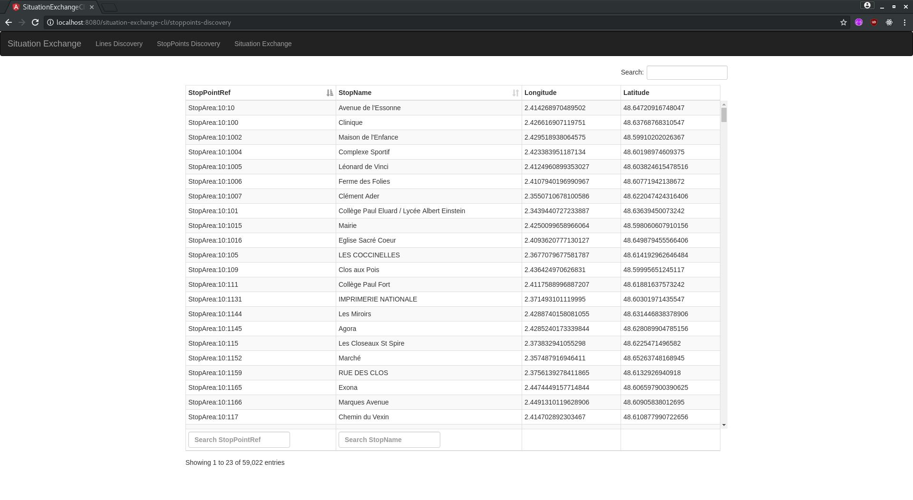

# Situation Echange Demo

## Utilisation

/bin/systemctl start mongod.service

java -jar situation_exchange-0.0.1-SNAPSHOT.jar

URL : <http://localhost:8080/situation-exchange-cli/index.html>  

Build : mvn clean install

## situation_exchange

### Fonctionnalitées

**situation_exchange** est une application Spring Boot (Java 8, Reactor et MongoDB) de démonstration permettant la publication de perturbation (SituationExchange) sur un réseau de transport dans les formats   

* Soap Webservice  SIRI (LinesDiscovery, StopPointsDiscovery, SituationExchange)  
  Spécification : <http://www.normes-donnees-tc.org/format-dechange/donnees-temps-reel/>
     
* REST Webservice SIRI-LITE (LinesDiscovery, StopPointsDiscovery, SituationExchange)  
  Spécification : <http://www.normes-donnees-tc.org/wp-content/uploads/2017/01/Proposition-Profil-SIRI-Lite-initial-v1-2.pdf>

## situation-exchange-cli

### Fonctionnalitées
**situation-exchange-cli** est un client permettant l’interrogation des services LinesDiscovery, StopPointsDiscovery, SituationExchange d' un serveur SIRI /SIRI_LITE, ainsi que l'edition de perturbation (SituationExchange).

### Principes
**situation-exchange-cli** est une application ANGULAR 5 écrite en typescript mettant en œuvre le pattern Flux/Redux et utilisant les bibliothèques twitter bootstrap et datatables.net (scroller : pagination infini).  

